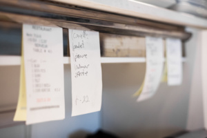

## A Familiar Routine
Imagine yourself at a restaurant. You walk in and eventually find yourself seated. Your waiter then introduces themself and lets you browse the menu. When you are ready, you place an order with the waiter, who then relays it to the kitchen. The kitchen prepares your meal, then the waiter delivers it to you.

Every time we go online, we encounter a similar procedure, albeit at a much more technical level. Though the end goal is the same, (person makes order → person receives order), there can be many different ways of fulfilling this goal, and underlying processes may vary from one approach to another.

## Forming Strategies for Common Problems
As an example of this, let’s revisit the restaurant analogy. In real life, the act of placing an order is a “high-level” process. When you request a certain menu item, you do not gather the ingredients and cook it yourself (unless you’re at Korean BBQ), nor do you tell the restaurant staff step-by-step instructions on how to prepare your meal from start to finish (unless you’re quite rude). Instead, you place an order, the kitchen prepares it for you, then the waiter serves you your meal. The entire time, you, the patron, are not involved in the underlying processes. You simply interact with an interface and in return receive the end product.

This example is mirrored by the Model-View-Controller (MVC) software design pattern. In this design pattern, the user’s interface is decoupled from the internal representation of information. Rather than having a user directly interact with internal processes, user-facing software acts as a mediator between the user themself and the internal structure of the application. The beauty (and necessity) of this system is that it allows both parties to do what they are good at. It takes the burden of solution implementation off of the user’s hands, and allows for scalability of a system. All the user has to do is properly formulate a request, and the system will handle it, allowing developers to reuse the same set of processes to solve similar problems.

## A Win-Win Situation
For these reasons – and many more – the MVC design pattern is a useful tool that I have even used in my own projects. By controlling user access to features, I streamline their experience and in turn simplify the design and development process by essentially narrowing the scope of problems that the system must address.
