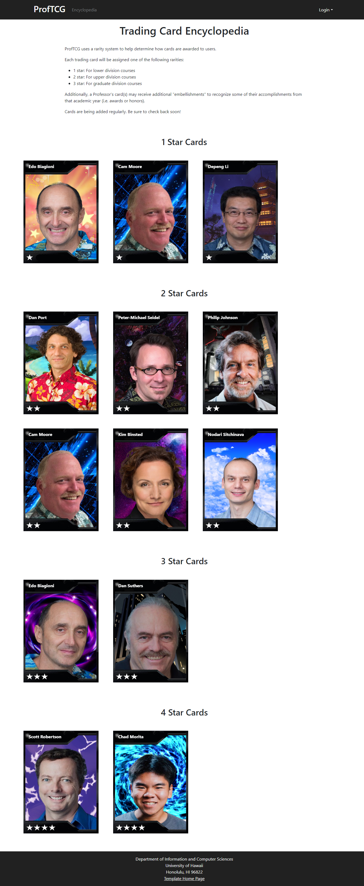

## About the Project
ProfTCG is a virtual trading card game for the UH Manoa community. Users can collect cards of their favorite professors and trade cards with other users to expand their collections. I developed ProfTCG along with 4 of my peers: Kent Burgess, Lucas Horsman, Donald Lipps, and Samantha Mallari.

In the current development stage, the site features 4 main pages:
1. Encyclopedia: A list of all cards that exist in the system
2. Your Cards: A list of all the cards in your collection
3. Card Packs: A page where users can obtain a new card for free once a day
4. Marketplace: A list of all cards that are available for trades

**Useful Links:**
- To access the deployed web application, visit [https://proftcg.me](https://proftcg.me).
- To read up on the development process, check out the [project page](https://proftcg.github.io/).
- To see the source code, check out the [GitHub Page](https://github.com/ProfTCG/proftcg).

## Tools and Frameworks
The web app UI was developed with React JS, along with some HTML and CSS. The backend functionality was created using Meteor and MongoDB. Throughout the development process, my team members and I used GitHub and GitHub projects for project management and goal tracking.

## Group Roles

Group roles were split up approximately evenly. Each group member played a role in both the frontend and backend development work for the project.

The main aspects of the project that I worked on were the trading card component and the Encylopedia page. For the trading card component, I helped design the trading cards, created a large portion of the sample data. For the encyclopedia, I designed the layout and used React and Meteor to dynamically render cards from our database. I also made contributions to the final UI for every page.

## Summary and Overview
This was a fun and challenging project. I loved having the opportunity to build something from the ground up. This was my first time seeing things like how to deploy a web application, set up HTTPS, and use Issue Driven Project Management (IDMP). I not only gained experience with React and Meteor, but also practiced soft skills like teamwork, troubleshooting, project management, and oral and written communication.